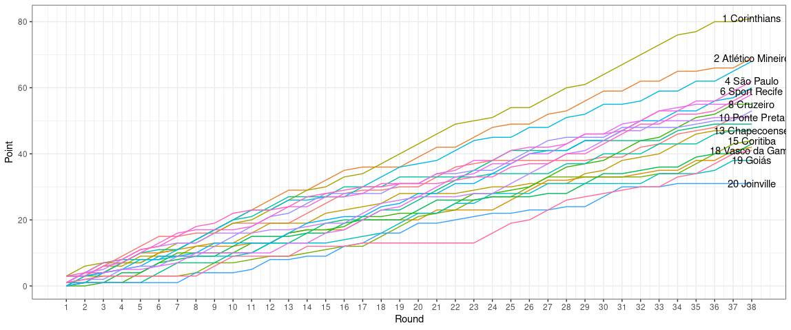

# SoccerScience


The project consists of some data science exercises using soccer data.
First of all, I've collected data from the last 14 years Brasileirão Série A and B. 
## Brazilian 1st division historical data

An example 2015' season's Brazilian 1st division standing.

```R
    Pos Team             Final Points Goals For Goals Against Goals Difference  Year
  <int> <chr>                   <dbl>     <int>         <int>            <int> <int>
1     1 Corinthians                81        71            31               40  2015
2     2 Atlético Mineiro           69        65            47               18  2015
3     3 Grêmio                     68        52            32               20  2015
4     4 São Paulo                  62        53            47                6  2015
5     5 Internacional              60        39            38                1  2015
6     6 Sport Recife               59        53            38               15  2015
```


## Most titles in the period

The data contains data from 2003's to 2020's season.

|Team          | Number of Titles|
|:--------------|-----:|
|Corinthians |     4|
|Cruzeiro    |     3|
|Flamengo    |     3|
|São Paulo   |     3|
|Fluminense  |     2|
|Palmeiras   |     2|
|Santos      |     1|

---
## Number of rounds as a leader in the period

|Team          | Rounds|
|:--------------|-----:|
|Corinthians |   156|
|Cruzeiro    |   122|
|Flamengo    |   114|
|São Paulo   |   114|
|Fluminense  |    76|
|Palmeiras   |    76|
|Santos      |    46|

---
## Most points in period
|Team               | Victories| Draws| Losses| Points|
|:-------------------|---------:|-----:|------:|------:|
|São Paulo        |       327|   188|    189|   1169|
|Santos           |       305|   182|    217|   1097|
|Flamengo         |       296|   196|    212|   1084|
|Internacional    |       292|   167|    207|   1043|
|Corinthians      |       281|   192|    193|   1035|
|Cruzeiro         |       293|   151|    222|   1030|
|Grêmio           |       283|   173|    206|   1022|
|Fluminense       |       270|   189|    245|    999|
|Atlético Mineiro |       267|   172|    227|    973|
|Palmeiras        |       266|   162|    192|    960|

---

## Heatmap period


## Teams performances in time-series

The figure below shows the overall performance among all teams that have appeared on a brasileirão série at least one time. The blue line shows the home performance. The red-filled line marks the team performance as a visitor.


  - Yellow rectangle marks the champion team
  - Green rectangle marks the Libertadores' zone
  - Black rectangle marks the relegation zone
  - Red rectangle marks the COVID-19 period


## Analysis of a specific season

### Positions throughout rounds

This plot shows the evolution points throughout the rounds among all teams.

First, I've tidy data in this format.

```R
    pos round team        sum_point
  <int> <int> <chr>           <dbl>
1     1     1 Corinthians         3
2     1     2 Corinthians         6
3     1     3 Corinthians         7
4     1     4 Corinthians         7
5     1     5 Corinthians         7
6     1     6 Corinthians        10
```




## Calculating probability

In this calculation, I choose a specific standing position, calculate the mean score of that position in historical data, finally get the number of chances of reach this score.


.svg)
number of combinations with repetition

.svg)
number of items in the pool (it may be for example number of alphabet letters, which we use to create words),

.svg)
number of items used (it may be for example length of the word or number of balls pulled out from the bucket).

### Example of using 5 rounds

---

```R
   `Round 1` `Round 2` `Round 3` `Round 4` `Round 5`
   <chr>     <chr>     <chr>     <chr>     <chr>    
 1 Win       Win       Win       Win       Win      
 2 Win       Win       Win       Win       Draw     
 3 Win       Win       Win       Win       Loss     
 4 Win       Win       Win       Draw      Draw     
 5 Win       Win       Win       Draw      Loss     
 6 Win       Win       Win       Loss      Loss     
 7 Win       Win       Draw      Draw      Draw     
 8 Win       Win       Draw      Draw      Loss     
 9 Win       Win       Draw      Loss      Loss     
10 Win       Win       Loss      Loss      Loss     
11 Win       Draw      Draw      Draw      Draw     
12 Win       Draw      Draw      Draw      Loss     
13 Win       Draw      Draw      Loss      Loss     
14 Win       Draw      Loss      Loss      Loss     
15 Win       Loss      Loss      Loss      Loss     
16 Draw      Draw      Draw      Draw      Draw     
17 Draw      Draw      Draw      Draw      Loss     
18 Draw      Draw      Draw      Loss      Loss     
19 Draw      Draw      Loss      Loss      Loss     
20 Draw      Loss      Loss      Loss      Loss     
21 Loss      Loss      Loss      Loss      Loss    
```

